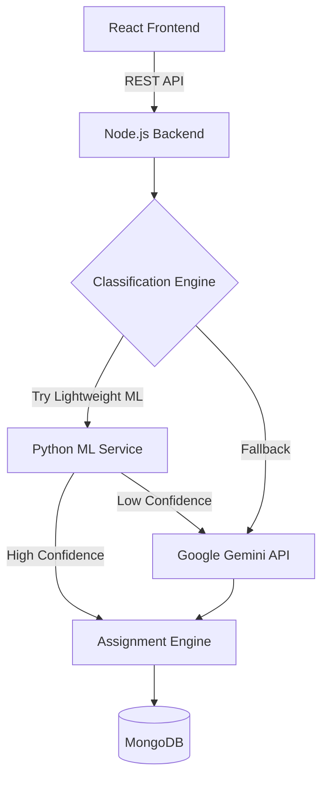
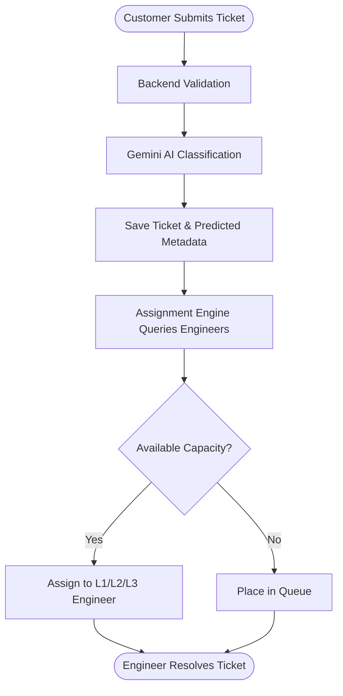
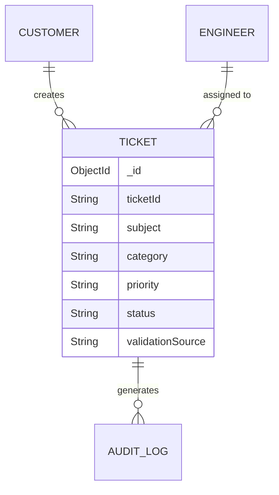

# SwiftDesk - Intelligent Helpdesk Ticketing System

## Table of Contents
- [Project Overview](#project-overview)
- [Features](#features)
- [Technology Stack](#technology-stack)
- [Project Architecture](#project-architecture)
- [Folder Structure](#folder-structure)
- [Installation Guide](#installation-guide)
- [Environment Variables](#environment-variables)
- [Ticket Lifecycle](#ticket-lifecycle)
- [Machine Learning Model](#machine-learning-model)
- [AI Integration (Gemini)](#ai-integration-gemini)
- [Engineer Assignment](#engineer-assignment)
- [Database Design](#database-design)
- [API Overview](#api-overview)
- [Logging](#logging)
- [Future Enhancements](#future-enhancements)
- [Why This Hybrid Approach?](#why-this-hybrid-approach)
- [Conclusion](#conclusion)

---

## Project Overview

**SwiftDesk** is a modern, intelligent, role-based helpdesk ticketing system designed to streamline customer support operations.

### What it does
SwiftDesk provides a centralized platform where customers can submit support tickets, and support teams can efficiently resolve them. It leverages Machine Learning and Google's Gemini AI to automatically classify incoming tickets by Category and Priority, minimizing manual triage. The system features an automatic assignment engine that intelligently assigns tickets to the most appropriate engineer based on their level (L1, L2, L3) and current workload capacity.

### The Problem it Solves
Traditional helpdesk systems rely heavily on manual dispatching. Support agents must read every ticket, guess its priority, and manually assign it to the right department. This creates a severe bottleneck, delays resolution times for critical issues, and results in misrouted tickets. SwiftDesk eliminates this bottleneck through intelligent zero-shot classification and automated dispatch.

### Target Users
- **Customers**: Can create tickets, view status updates, communicate with support, and receive automated notifications.
- **Engineers**: Can view their assigned queue, resolve tickets, escalate issues, and communicate with customers.
- **Admins**: Can oversee all tickets, manage engineers and customers, analyze system performance, and override assignments.

---

## Features

- **User Authentication & Role-Based Access**: Secure login and protected routes for Customers, Engineers (L1/L2/L3), and Admins.
- **Intelligent Ticket Creation**: Customers submit issues with subjects and descriptions.
- **Ticket Tracking & Lifecycle**: Full state tracking (New → Assigned → In Progress → Resolved → Closed).
- **AI-Powered Ticket Classification**: Automatically infers Category (Billing, Technical, Account, etc.) and Priority (Low, Medium, High, Critical) using a hybrid ML + LLM pipeline.
- **Automated Ticket Assignment**: Intelligently assigns tickets to the right engineer level based on predicted priority and current engineer workloads. Includes a dynamic queueing system if all engineers are at capacity.
- **Engineer Management**: Role leveling, workload tracking, and skill-based assignment logic.
- **Interactive Dashboards**: Role-specific portals for tracking KPIs, active queues, and historical data.
- **Audit Logs**: Every status change, assignment, and classification is tracked immutably.
- **Notifications**: Automated in-app or email alerts triggered upon ticket creation, assignment, and resolution.

---

## Technology Stack

The project uses the **MERN** stack (MongoDB, Express, React, Node.js) combined with Python for Machine Learning and Google Gemini API for advanced NLP.

- **MongoDB**: A NoSQL document database. Chosen for its flexible schema design, allowing us to easily evolve the `Ticket` model and store complex nested audit logs.
- **Express.js**: A minimal web framework for Node.js. Used to build robust, scalable REST APIs.
- **React.js**: A declarative frontend JavaScript library. Chosen for building dynamic, responsive, and component-based user interfaces.
- **Node.js**: A JavaScript runtime environment. Allows for a unified JavaScript codebase across frontend and backend, enabling high concurrency for I/O heavy operations (like database querying and API calls).
- **Python / FastAPI**: A secondary microservice used for the lightweight Machine Learning classification.
- **Google Gemini API**: A state-of-the-art Large Language Model (LLM) used for intelligent zero-shot text classification.

**Why MERN?**
MERN provides a unified, full-stack JavaScript environment. This reduces context-switching, allows for code reuse, and provides excellent performance for asynchronous, I/O-heavy operations commonly found in ticketing backends.

---

## Project Architecture

The architecture consists of a React frontend, a primary Node/Express REST API, a lightweight Python ML microservice, and Google Gemini API for fallback/advanced classification.



### Data Flow
1. The **Frontend** sends a ticket payload to the **Backend**.
2. The Backend intercepts the request and attempts to classify the ticket text.
3. The **Python ML Service** acts as the first line of defense for classification.
4. If the ML model is uncertain, or if a more advanced inference is needed, the request is escalated to **Google Gemini AI**.
5. The classified ticket (with predicted priority) is passed to the **Assignment Engine**, which queries the database for available engineers.
6. The finalized ticket and assignment are persisted to **MongoDB**.

---

## Folder Structure

```
swift-desk/
├── frontend/             # React.js Frontend Application
│   ├── src/
│   │   ├── components/   # Reusable UI components (Buttons, Modals, Steppers)
│   │   ├── pages/        # Role-specific views (AdminDashboard, CustomerPortal)
│   │   ├── hooks/        # Custom React hooks (useTickets, useAuth)
│   │   └── index.css     # Global stylesheets
├── backend/              # Node.js + Express REST API
│   ├── config/           # Setup files (Database connection, Gemini SDK initialization)
│   ├── controllers/      # Route handlers and business logic
│   ├── middleware/       # Custom Express middleware (Authentication, Error Handling)
│   ├── models/           # Mongoose schemas (Ticket, User, AuditLog)
│   ├── routes/           # Express router definitions (/api/tickets, /api/auth)
│   ├── services/         # Core business logic (AssignmentEngine, GeminiService)
│   └── utils/            # Helper functions (geminiPrompt builders)
├── ml-service/           # Python FastAPI Machine Learning Microservice
│   ├── main.py           # API endpoints for prediction
│   ├── predictor.py      # ML Model loading and inference logic
│   └── trainer.py        # Scripts to retrain models based on resolved tickets
└── README.md             # Project documentation
```

---

## Installation Guide

### Prerequisites
- Node.js (v18+)
- Python (v3.10+)
- MongoDB URI (Local or Atlas)
- Google Gemini API Key

### 1. Clone the repository
```bash
git clone https://github.com/your-username/swiftdesk.git
cd swiftdesk
```

### 2. Install Backend Dependencies
```bash
cd backend
npm install
```

### 3. Install Frontend Dependencies
```bash
cd ../frontend
npm install
```

### 4. Configure Environment Variables
Create a `.env` file in the `backend/` directory using the variables described in the next section.

### 5. Start the ML Service (Optional/Legacy Support)
```bash
cd ml-service
pip install -r requirements.txt
python main.py
```

### 6. Start Backend & Frontend
Open two terminal windows:
```bash
# Terminal 1: Backend
cd backend
npm run dev

# Terminal 2: Frontend
cd frontend
npm run dev
```

### 7. Expected URLs
- **Frontend**: `http://localhost:5173`
- **Backend API**: `http://localhost:5000`
- **ML Service**: `http://localhost:8000`

---

## Environment Variables

The backend requires the following variables defined in `backend/.env`.

| Variable | Description |
| :--- | :--- |
| `PORT` | The port the Node API runs on (default `5000`) |
| `MONGO_URI` | MongoDB connection string |
| `JWT_SECRET` | Secret key used to sign Authentication tokens |
| `JWT_EXPIRES_IN` | Token expiration time (e.g., `7d`) |
| `GEMINI_API_KEY` | Your Google API Key for Generative AI |
| `GEMINI_MODEL` | The Gemini model to use (e.g., `gemini-3.1-flash-lite`) |
| `ML_SERVICE_URL` | URL of the Python microservice (default `http://localhost:8000`) |

---

## Ticket Lifecycle

When a customer submits an issue, SwiftDesk executes a highly orchestrated pipeline.



### Step-by-Step Flow:
1. **Creation**: Customer submits a Subject, Description, and an optional guess at the Category/Priority.
2. **Validation**: The backend sanitizes inputs and ensures the user exists.
3. **AI Classification**: The text is sent to Google Gemini API. Gemini ignores the user's subjective priority guess and intelligently assigns an objective Priority and Category based on the textual context.
4. **Persistence**: The ticket is saved to MongoDB exactly once, locking in the AI predictions.
5. **Assignment**: The engine looks for engineers matching the required support level (L1 for Low, L2 for Medium, L3 for High/Critical) who are currently below their maximum active ticket capacity.
6. **Queuing**: If no engineers are available, the ticket is placed in a priority-sorted queue.
7. **Resolution**: The assigned engineer resolves the ticket, which triggers an audit log, a customer notification, and frees up capacity to drain the queue.

---

## Machine Learning Model

SwiftDesk employs a hybrid intelligence approach. The system initially utilizes a lightweight Python-based ML microservice (e.g., TF-IDF with Logistic Regression or a small SVM). 

- **Why a lightweight ML model?**: Extremely fast execution, virtually zero operational cost, and completely offline capability.
- **Limitations**: Traditional NLP models struggle with nuance, sarcasm, complex multi-part questions, and emerging zero-day technical terminology. 
- **The Threshold**: If the ML model returns a confidence score below a defined threshold, it acknowledges its uncertainty and escalates the ticket to the Gemini LLM.

---

## AI Integration (Gemini)

Google Gemini is integrated directly into the Node.js backend (`geminiService.js`) to handle complex ticket classification.

- **Why Gemini?**: LLMs possess immense contextual understanding. They can correctly identify that "I cannot access my invoice" is a `Billing` issue with `High` priority, even if the word "billing" is never explicitly used.
- **Data Sent**: The model receives the ticket Subject, Description, and the customer's optional Category/Priority selections.
- **Strict Output**: The system utilizes rigorous prompt engineering to force Gemini to return *only* a valid JSON object matching our exact schema requirements, eliminating hallucinations.

### Example JSON Response
```json
{
  "category": "Technical",
  "priority": "High",
  "confidence": 0.98,
  "reason": "The user is experiencing a complete system crash which severely impacts operations."
}
```

### Resiliency
The `geminiService.js` implements markdown-stripping, strict enum validation, automatic retries upon failure, and a safe fallback to the user's selected inputs if the API is entirely unreachable.

---

## Engineer Assignment

The automated Assignment Engine (`assignmentEngine.js`) completely removes the need for manual dispatchers.

- **Leveling**: 
  - `Low` priority tickets demand an **L1** engineer.
  - `Medium` priority tickets demand an **L2** engineer.
  - `High/Critical` priority tickets demand an **L3** engineer.
- **Workload Balancing**: Engineers have a defined `max_capacity`. The engine queries MongoDB for eligible engineers who have `active_tickets < max_capacity` and assigns the ticket in a round-robin or least-busy fashion.
- **Queuing**: If all L2 engineers are busy, a Medium ticket enters the queue. When an L2 engineer resolves an active ticket, the `queueDrainer` automatically assigns them the oldest queued Medium ticket.

---

## Database Design

The application utilizes MongoDB to store flexible, document-based records.



### Key Collections
- **Customers**: Contains customer credentials, contact info, and aggregate stats.
- **Engineers**: Contains staff credentials, support tier levels (L1/L2/L3), and current capacity metrics.
- **Tickets**: The core entity tracking status, metadata, AI confidence, and timelines.
- **AuditLogs**: Immutable ledger recording every state change, AI classification, and assignment action for compliance.

---

## API Overview

The REST API is highly modularized under `/api/`:

- **Auth APIs** (`/api/auth`): Login and JWT token generation.
- **Ticket APIs** (`/api/tickets`):
  - `POST /` - Creates, classifies, and assigns a ticket.
  - `GET /` - Fetches paginated tickets with role-based filtering.
  - `PATCH /:id/status` - Updates ticket state and drains queues.
- **Dashboard APIs** (`/api/dashboard`): Aggregates statistical data for UI metrics.
- **Notifications APIs** (`/api/notifications`): Retrieves user alerts.

---

## Logging

SwiftDesk features extensive logging for debuggability and AI observability. When a ticket is created, the system logs:

1. **Input**: Raw customer inputs.
2. **AI Payload**: The exact prompt/request sent to Gemini.
3. **AI Response**: The raw, unparsed string returned by Gemini.
4. **Parsed Result**: The sanitized JSON object.
5. **Database Result**: The final values committed to MongoDB.
6. **Assignment Action**: Whether it was queued or assigned, and to whom.
7. **Errors & Fallbacks**: Any network failures and the subsequent fallback resolution.

---

## Future Enhancements

The MERN + AI architecture makes SwiftDesk highly extensible. Potential future enhancements include:
- **Ticket Summarization**: Using Gemini to summarize 50-message long ticket threads for incoming engineers.
- **Automatic Reply Generation**: Suggesting empathetic, context-aware draft responses for engineers to approve.
- **Similar Ticket Recommendations**: Vectorizing tickets to surface past resolved issues matching current symptoms.
- **Knowledge Base Integration**: Automatically generating public FAQ articles from successfully resolved L3 tickets.

---

## Why This Hybrid Approach?

By combining a traditional REST architecture with both a localized Machine Learning model and Google Gemini AI, SwiftDesk achieves the best of both worlds. 

Relying purely on a heavy LLM for every single "password reset" ticket is slow and expensive. Relying purely on basic ML results in poor accuracy for nuanced IT problems. 

Our hybrid approach routes standard, highly-predictable queries to the low-latency ML service, while escalating ambiguous, critical, or complex tickets to Gemini. This guarantees **high accuracy**, **low operational latency**, **reduced API costs**, and **massive scalability**.

---

## Conclusion

SwiftDesk transforms reactive IT support into a proactive, intelligent machine. By leveraging modern MERN architecture paired with cutting-edge Large Language Models, the system entirely automates the triage dispatch process. This reduces manual administration effort, decreases resolution time for critical issues, balances staff workloads efficiently, and provides a premium, responsive experience for end-users.